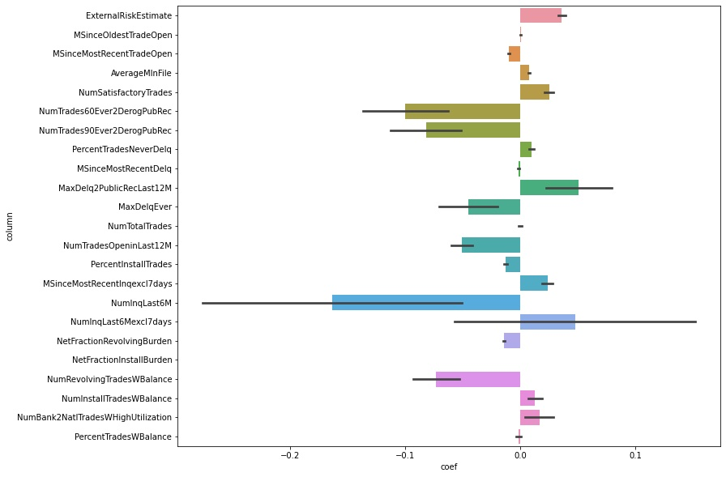
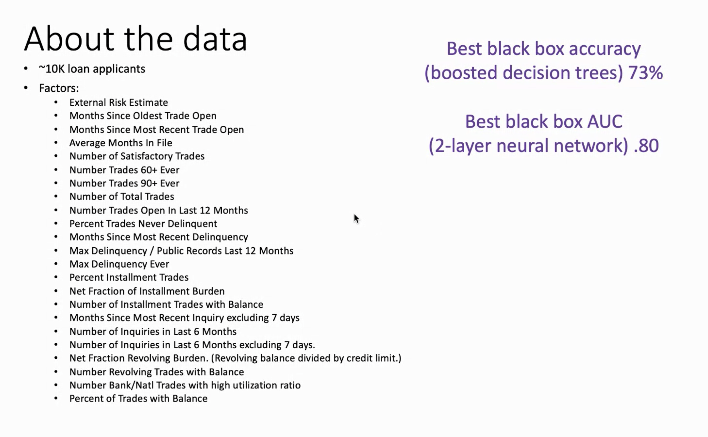

# FICO Challenge

With 10-fold (outer) cross-validation:

  * 70% accuracy 
  * 77% ROC AUC
  
With 2 lines of ML code, and interpretation (coefficients) that matches
intuitions from provided Data Dictionary.

# Dataset

[community.fico.com/s/explainable-machine-learning-challenge](https://community.fico.com/s/explainable-machine-learning-challenge)

